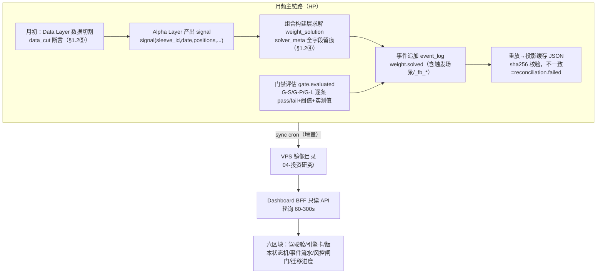
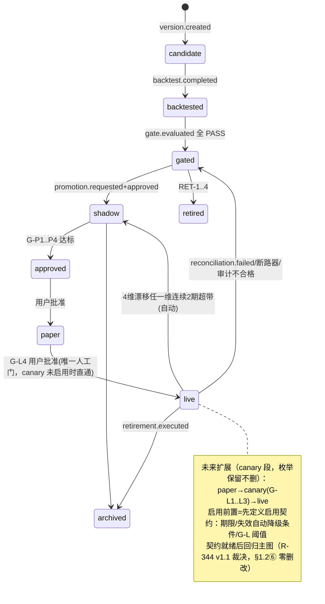
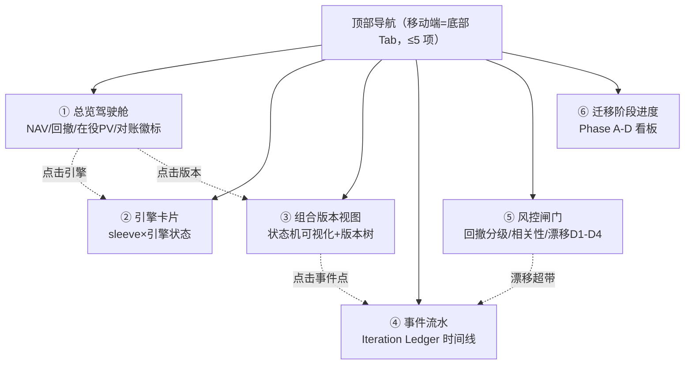

# R-342 R-336 实施级架构设计（含 Dashboard 全新可视化设计）

> 任务 task-0529/task-0534 ｜ 2026-08-28 ｜ 状态：设计报告（纯设计零代码）｜ 当前版本 v1.2（修订记录见文末）
> 设计依据（唯一口径）：R-336 v1.2《破而后立量化系统目标架构与迁移方案》。本文所有「§N」引用除特别注明外均指 R-336 原文章节。新增设计不与 v1.2 冻结条款冲突；凡与冻结条款相关的字段名/阈值/事件类型一律原文引用。

## 架构一图流

```mermaid
flowchart LR
  subgraph HP["HP 量化主机 ~/quant-evolve（唯一写点）"]
    D1["① Data Layer<br/>四口径·tradable_mask"] --> D2["② Alpha Layer<br/>evolution_pipeline"]
    D2 --> D3["③ Backtest Layer<br/>composite_backtest"]
    D3 --> D4["④ 组合构建层<br/>等波动率求解器"]
    D4 --> D5["⑤ Portfolio Layer<br/>portfolio_version"]
    D5 --> D6["⑥ Execution Layer<br/>paper/canary/live"]
    D7["⑦ Risk Layer 横切⑤⑥<br/>熔断>组合级>单腿级"]
    EL["Iteration Ledger<br/>append-only JSONL"]
    D4 -. weight.solved .-> EL
    D5 -. promotion.* .-> EL
    D7 -. risk.action .-> EL
    EL --> PROJ["投影缓存 registry/engines/composites JSON"]
  end
  HP -->|"sync cron（只读镜像）"| subgraph VPS["VPS shared/results/04-投资研究/"]
    SYNC["同步目录：ledger/registry/产物 csv+json"]
  end
  VPS --> READ["新 Dashboard BFF（只读 API，重放投影消费）"]
  READ --> UI["新前端 SPA：六区块，390px 移动端优先"]
  USER["用户"] -->|读| UI
  USER -->|人工门操作（G-L4 批准等）| TC["任务中心/HP 流程"]
```

## 关键决策摘要（≤10 条）

1. **三落点分工**：计算与写入全部在 HP（事件账本、投影、求解器），VPS 只持只读镜像（sync cron 产物），新 Dashboard 是纯只读消费者——写操作（用户批准类，G-L4 唯一人工门，§4.3）一律走任务中心/HP 流程，前端不提供任何写入口。
2. **事件账本照抄冻结条款**：`events/iteration-ledger-YYYY-MM.jsonl`，格式 `{ts, actor, event_type, target, payload}`，flock+fsync+月滚动，投影 sha256 校验（§3.3）。不引入消息队列/数据库（§3.3 明文冻结），本设计不新增任何账本存储引擎。
3. **投影缓存=JSON，读侧加速可选 SQLite 物化**：source of truth 只有账本+JSON 投影；Dashboard 可选一层只读 SQLite 物化（沿用现有 agent-dashboard 的 node:sqlite 基建），语义=「可随时删了重建的投影缓存」（§3.1 表：JSON 降级为投影缓存），不承载任何唯一状态。
4. **七层映射**：现有 HP 管线（evolution_pipeline / registry / paper 引擎 / ddc）分别归 Alpha / Portfolio / Execution / Risk 层载体；**新建**=组合构建层求解器与 Iteration Ledger（§1.2④、§3）；Data 层四口径校验器从现有散点收敛为唯一出口。
5. **portfolio_version schema 一次到位按 v1.2 A1**：sleeves 附 `code_hash + data_cut`、`capital_policy{gross_limit, net_limit}`、solver_ref 扩 `tolerances + fallback`；`data_cut ≤ min(所有输入数据源最大时间戳)` 硬断言，违反即 `config.invalid` 绝对阻塞（§1.2⑤）。
6. **状态机含反向降级**：正向 `candidate → backtested → gated → shadow → approved → paper → canary → live`，反向 `live → shadow`（4 维漂移超标）/ `live → gated`（reconciliation.failed / 断路器 / 审计不合格），全部走 `promotion.downgraded` 事件，禁人工直改 JSON（§1.2⑤）。
7. **Dashboard 技术栈推荐：Vite + React SPA + Express BFF**（备选 SvelteKit 放弃理由见 §4.1）；部署=现有 nginx 反代 + systemd 单元，单机 VPS 零新增常驻依赖之外的基础设施。
8. **实时性=HTTP 轮询**（总览 60s / 其余 300s），不启用 SSE/WebSocket：月频调仓系统的状态变化天然低频（事件级：日/调仓日/门禁评估时），推送通道的连接管理成本 > 收益；预留 Phase C 后按需升级 SSE 的接口形态（同一路径可演进）。
9. **390px 移动端优先为硬约束**：全局 `overflow-x: hidden` + 容器断点组件规范（见 §4.4），任何区块禁横向滚动；表格降级为卡片列表，状态机图降级为状态胶囊。
10. **过渡三步走**：并行新建（Phase B，读旧+新双源）→ 验收（双看板对照 ≥1 个调仓周期）→ 切换（Phase C 指针切换获批准后，nginx 路由级切换，秒级回退）；旧 agent-dashboard 保留至 Phase D 才退役，观测能力不断档。

---

## 第 1 章 系统总览

### 1.1 三落点职责分工

| 落点 | 职责 | 明确不做 |
|---|---|---|
| **HP（~/quant-evolve）** | 全部计算与唯一写入：七层管线、组合构建求解器、Iteration Ledger 追加、投影重放、paper/canary/live 执行 | 不对外提供 UI；不直接对账 VPS 只读镜像 |
| **VPS shared/results/04-投资研究/** | sync cron 落盘的只读镜像：ledger JSONL、registry/engines 投影、各引擎 nav/trades/metrics/holdings 产物族、报告 md | 不在镜像目录做任何回写；镜像即证据 |
| **VPS 新 Dashboard** | 只读 API（BFF）+ 前端呈现：读镜像与投影缓存，重放查询，向用户呈现六区块 | 零写入口：人工门（G-L4 批准、Phase C 指针切换）一律走任务中心/HP 流程 |

写路径唯一性是 §3「append-only、状态可重放」的结构前提：若前端可写，等于绕过事件账本直改状态，正是 R-336 §3.1 表中列为「破」对象的操作模式。

### 1.2 数据流图（月频主链路）

月频链路 = 数据 → 因子 → 组合求解 → 事件流水 → 前端呈现：



要点：
- **事件先行**：每次状态变更（求解、门禁、晋升、降级、风控动作）都先追加事件、后刷投影；前端读投影 + 查事件，二者由同一账本重放生成，天然一致（§3.3 重放伪代码口径）。
- **月频但日更**：调仓是月频，风控监控（D1 日 P&L 偏差 ≤20bp/日，§7.2）与 NAV 对账是每日——所以 Dashboard 的轮询周期按区块分频，而非全局一个频率（详见 §4.3）。
- **canary 未启用（按 R-344 v1.1 裁决）**：§1.2⑥ 状态枚举与字段不删不改；前端主图渲染止于 approved→paper→live，canary 移入「未来扩展」段呈现，启用前置=先定义启用契约（期限、失效自动降级条件、G-L 阈值），契约就绪后回归主图。

### 1.3 与在役系统的关系

在役 paper/实盘三元组（A 引擎 + gold 引擎 + ddc 风控）在 Phase B 以 vC-0 快照形式进入 portfolio_version（§8 Phase B 动作 1：首条=当前在役三元组），旧 agent-dashboard 与新 Dashboard 并行服务至 Phase C 切换完成；Phase D 旧件退役（§8 Phase D 动作 1：新代码/UI/报告只用标准名）。本设计全部读侧动作不触碰 registry active / paper_engine / HP crontab 在役项。

## 第 2 章 七层落地映射

总原则：**能用现有载体的不重建，重建的只有「构建层求解器 + 事件账本 + 只读 API + 前端」四件**。术语一律用 GLOSSARY 标准名（附录 A：evolution_pipeline=Research-to-Production Pipeline、registry=Model Registry、composites.json=Portfolio Registry）。

| R-336 层（章节） | 实现载体（HP） | 复用/新建 | 落点存储 |
|---|---|---|---|
| ① Data（§1.2①） | 四口径校验器 + data adapter 注册表：PIT 对齐（R-328）、qfq 唯一口径（R-330 F4）、退市全包含、涨跌停 tradable_mask、成本模型（R-333 三情景 4.0/11.5/15.7bp） | 复用散点实现，**收敛为唯一出口**（新 adapter 注册制） | HDF5/Parquet 面板（现有）+ 口径清单 JSON |
| ② Alpha（§1.2②） | evolution_pipeline（registry 版，g1-g6 组件门禁=CG-1..6） | 复用 | signal 面板文件 + registry（投影缓存） |
| ③ Backtest（§1.2③） | composite_backtest + 组件回测；F6/F7 口径插件化（§8 Phase B 动作 3：F1 md5 915e446388… 逐位对齐 + PIT 四锚点断言）；第二裁判=qrun 双轨注册 | 复用+插件化改造 | backtest_report JSON（含 md5_anchor）+ results/ 报告文件 |
| ④ Portfolio Construction（§1.2④） | **新建**：等波动率求解器 v1 → 风险预算/ERC；协方差 LW vs 样本 vs EWMA 对比留档（§8 Phase B 动作 6）；MVO 对比跑批不启用仅留档（§8 Phase B 动作 7） | 新建 | weight_solution 进 event_log（JSONL），永不落可变 JSON |
| ⑤ Portfolio（§1.2⑤） | **新建**：portfolio_version 对象 + vC-0 快照（§8 Phase B 动作 1，schema 按 v1.2 A1 一次到位） | 新建（继承 R-335 设计改名） | event_log + 投影缓存 composites.json |
| ⑥ Execution（§1.2⑥） | paper 引擎复用（语义归 Execution Layer）；canary 段预留未启用；checkpoint 快照接入（§8 Phase C 动作 4） | 复用+指针语义切换（Phase C，需批准） | execution_report JSON + checkpoint 文件 |
| ⑦ Risk（§1.2⑦） | ddc 状态机复用（参数下沉 sleeve 版本对象）；回撤分级闸门/断路器/冷却期按 §4.4 与 §6 落地；裁决三段式=§7.5.3 唯一出处 | 复用+新增闸门 | risk.* 事件进 event_log（risk-events.jsonl 既有资产并入） |

### 2.1 模块间接口（沿 §1.2 输出契约，不新造）

- `bar(symbol, date, ohlqfq_adj, tradable_mask, pit_fields...)` —— Data→上层唯一出口（§1.2①）。
- `signal(sleeve_id, date, positions, ic_series, turnover_estimate)` —— Alpha→Backtest/构建层（§1.2②）。
- `backtest_report(portfolio_version_id, metrics, gate_results[], assumptions[], md5_anchor)` —— Backtest→Portfolio（§1.2③）。
- `weight_solution(portfolio_version_id, solve_date, weights{}, solver_meta{...})` —— 构建层→组合层，**只追加进 event_log**（§1.2④：配置与求解分离，禁止 portfolio_version 上加 model_weights 字段）。
- `execution_report(date, fills, slippage_actual, nav, checkpoint_ref)` —— Execution→账本（§1.2⑥）。

### 2.2 存储选型与理由（每项含备选）

| 存储 | 选型 | 理由 | 备选与放弃理由 |
|---|---|---|---|
| 事件账本 | 本地 JSONL（flock+fsync+月滚动） | §3.3 冻结条款，个人单机下满足「事件不可改、状态可重放、历史可审计」三要件 | SQLite/消息队列：违反 §3.3「不引入消息队列/数据库」冻结约束，放弃 |
| 状态投影 | JSON 文件（重放 dump 回 registry/engines/composites） | §3.1 表冻结：JSON 降级为投影缓存，可随时删了重建 | 数据库为主存储：同上冲突 |
| Dashboard 读侧缓存 | node:sqlite 只读物化（BFF 内，可选） | 复用现有 agent-dashboard v4 基建（Express+node:sqlite 零原生依赖）；语义仍是投影缓存，删了重建无损失 | 纯内存每请求重放：账本增长后轮询每 60s 全量重放开销不可控，放弃 |
| 产物文件 | csv+json 文件族（现状） | 1976 个文件、HP↔VPS rsync 增量同步成熟，回测/复盘工具链直读 | 对象存储/DB：改变 sync cron 与全部下游工具读法，收益为零，放弃 |

### 2.3 状态迁移守护者（state guardian，HP 侧，v1.2 新增）

- **落点**：HP `~/quant-evolve`（唯一写点侧）；只消费账本事件与风控状态，产出仍走事件追加，禁直改投影 JSON。
- **消费输入**：①4 维漂移任一维连续超带（D1-D4，§7.2 口径）；②reconciliation.failed（投影 sha256 校验不一致）；③断路器触发/冷却期到期。
- **产出**：`promotion.downgraded` 事件（live→shadow / live→gated，§3.3 反向边），payload 含触发规则、实测值、连续超带期数——与人工/管线触发的同名事件同构，禁新造事件类型。
- **运行频率双档**：日频轻巡（收盘后对账+漂移带检查，与既有日频风控同窗口）；月频调仓后置检（调仓执行完成后 24h 内对在役版本状态一致性全量复核一次）。
- **故障纪律**：守护者自身故障只告警不自动补做降级（降级动作必须可由事件追溯）；排期随 W4（§5.1），事件语义依赖 W1 读取层先行对齐。

## 第 3 章 版本与状态机数据设计

### 3.1 portfolio_version schema（照抄 §1.2⑤ v1.2 A1 冻结结构）

```json
{
  "portfolio_version_id": "PV-0.1",
  "sleeves": {
    "equity_sleeve": {"component_ref": "...", "code_hash": "sha256:...", "data_cut": "2026-08-01"},
    "hedge_sleeve_gold": {"component_ref": "...", "code_hash": "sha256:...", "data_cut": "2026-08-01"}
  },
  "risk_control": {
    "drawdown_gates": {"lt5": "normal", "5_10": "escalated_review", "10_15": "cut_half", "gt15": "circuit_break"},
    "vol_target": {"target_vol": 0.08, "rebalance_band": 0.02},
    "backfill_rule": "禁止回填含未来信息的统计量"
  },
  "per_sleeve_risk_cap": null,
  "solver_ref": {"solver_id": "equal_vol", "params": {}, "tolerances": {}, "fallback": {}},
  "capital_policy": {"gross_limit": 1.0, "net_limit": 0.95},
  "parent_version": "PV-0.0",
  "status": "live",
  "gate_report": "gate_report_ref",
  "paper_entered_at": "2026-09-01T00:00:00+08:00",
  "paper_duration": "auto"
}
```

落地要点（全部为冻结条款，非本设计新增）：
- **data_cut 硬断言**：`data_cut ≤ min(所有输入数据源最大时间戳)`，校验器强制，违反即 `config.invalid` 绝对阻塞、不允许降级放行（§1.2⑤）。
- **risk_control 只存组合级**：单腿 ddc 参数下沉 sleeve 版本对象；`per_sleeve_risk_cap` 语义=只封顶、不下指令（§1.2⑤）。
- **版本承诺边界**（§7.5.1 验收硬门）：「预算怎么分」进版本，「分出来的数」运行时算——换求解器/改风险预算/增减 sleeve/改相关性筛查阈值=必须升版本；协方差刷新与 RC 漂移重算不升版本。
- **vC-0 快照**：Phase B 首条=当前在役三元组（§8 Phase B 动作 1）。构建规程（v1.2 补）：①cutoff 时刻=Phase B 启动日执行构建，`data_cut` 取 T-1 交易日（按 A 股交易日历）；②三组件（A 引擎/gold 引擎/ddc）`code_hash` 锚定=组件仓库 git sha + registry 快照 id 双锚，任一变更即视为在役代码变更；③跨调仓周期在役代码变更策略（**结论：重打快照**）——不阻塞在役运行，触发新建子版本快照（parent_version 链留痕）自下一事件起生效，已发生事件归属按 ts 不回溯；④签名与时间=HP 侧执行者（actor 记账）+ 用户批准引用（任务中心登记），快照体内记 `built_ts`。

### 3.2 event_log 落地

- 文件：`events/iteration-ledger-YYYY-MM.jsonl`，每行 `{ts, actor, event_type, target, payload}`；actor ∈ {evolution_pipeline, user, risk_layer}；写前 flock、写完 fsync、按月滚动（§3.3）。
- 事件类型 = §3.2 枚举 v1 原样：version.created / version.updated / component.registered / solver.selected / weight.solved / gate.evaluated / promotion.requested / promotion.approved / promotion.rejected / promotion.executed / promotion.downgraded / risk.action / retirement.triggered / retirement.executed / backtest.completed / reconciliation.failed / checkpoint.created。
- 既有资产并入：`experiment-ledger.jsonl`、`risk-events.jsonl`（EV-xxx 事件族）按 component.registered / risk.action 语义映射导入，历史行不重写（append-only 原则），仅加 import 标记事件。
- retention_policy：近 12 个月为热数据（月滚动 JSONL 原样保留，BFF 启动重放热数据）；更早按年归档 gzip 冷档（`events/archive/iteration-ledger-YYYY.jsonl.gz`），BFF 启动时合并冷档索引供历史溯源查询；冷档只读、不参与高频重放路径。
- 写锁约定：flock 锁文件路径 `events/.ledger.lock`，模式 `LOCK_EX|LOCK_NB`（排他+非阻塞）；获锁失败立即记 warn 并短重试，超时记日志告警、不无限阻塞写入主流程。
- 灾备最小条款（v1.2 补）：①账本每日异地副本——sync cron 之外增加第二 rsync 目标目录（`events.backup/`，传输前 gzip 压缩当日滚动文件），保留 ≥3 个月；②sync_lag 超阈恢复 SOP：确认 HP 写入正常 → 检查 rsync 进程/网络 → 手动补跑 sync → 核对投影 sha256 一致后才解除「数据陈旧」横幅（§4.3）；③reconciliation.failed 处理优先级=P0：冻结受影响端点的状态展示（见 §4.1 指标：相关端点 503），1 个交易日内人工裁决修复或回放，修复动作本身走事件追加留痕。

### 3.3 状态机持久化与查询



前端渲染口径（v1.2，对齐 R-344 v1.1 区块③裁决）：主图止于 approved→paper→live；canary 段入「未来扩展」折叠呈现，上图 note 保留其完整迁移语义。

- 正向晋升串行链 + 反向降级（live→shadow / live→gated）全部通过 `promotion.*` 事件驱动；**禁止人工直改 JSON**（§1.2⑤：降级事件同样追加 event_log）。
- **持久化**：状态本体只存在于账本重放结果；投影缓存 JSON 是物化（头部带 sha256，重放后比对，不一致即 reconciliation.failed，§3.3）。
- **查询路径**：BFF 启动时全量重放 + 每次轮询增量重放新事件行 → 生成 SQLite 物化视图（版本表/状态表/事件索引表）→ API 只查 SQLite。重放幂等（§3.3 重放伪代码：version.created 建对象、promotion.executed 移指针、risk.action 记录）。
- **启动重放性能目标**：≤3s（12 个月账本规模）；重放在 BFF 启动后台执行、不阻塞 API 响应——物化未就绪期间对应端点返回显式「初始化中」状态，不返回空数据假装正常。

### 3.4 前端 API 契约（BFF 只读）

| Endpoint | 方法 | 请求 | 响应结构 | 对应区块 |
|---|---|---|---|---|
| `/api/v1/overview` | GET | `?date=YYYY-MM-DD`（默认最新） | `{nav, nav_chg_1d, mdd, drawdown_pct, active_pv{portfolio_version_id,status}, sleeves[{id,weight,nav,mdd}], last_event_ts, reconciliation_ok}` | 总览驾驶舱 |
| `/api/v1/engines` | GET | — | `engines[{sleeve_id, status, ic_latest, icir_oos, last_signal_date, paper_or_shadow_days}]` | 引擎卡片 |
| `/api/v1/portfolios` | GET | `?status=&limit=` | `[{portfolio_version_id, parent_version, status, created_ts, solver_id, gate_pass_ratio}]` | 组合版本视图 |
| `/api/v1/portfolios/:id` | GET | — | `portfolio_version 全 schema + 状态历史 events[...] + 当前 weight_solution` | 组合版本视图 |
| `/api/v1/portfolios/:id/timeline` | GET | `?from=&to=` | `events[{ts,event_type,actor,summary}]`（按 target 过滤账本） | 版本详情/事件流水 |
| `/api/v1/events` | GET | `?type=promotion.*&limit=50&cursor=` | `{items:[{ts,event_type,target,actor,payload摘要}], next_cursor}` | 事件流水 |
| `/api/v1/risk/gates` | GET | — | `{portfolio_dd_gate{drawdown_pct,band,action}, vol{target,realized,in_band}, sleeves_ddc[{id,state,drawdown,th}], correlation{pair,corr_20d,flag:0.75/0.85/0.90}, circuit_breaker{state,reason}}` | 风控闸门 |
| `/api/v1/risk/drift` | GET | `?pv=&window=` | `D1..D4[{dim,value,band,in_band,consecutive_violations}]` | 风控闸门-漂移子区 |
| `/api/v1/migration` | GET | — | `{phase:"A|B|C|D", items[{id,title,state:done|doing|todo,evidence_ref}], blocking:{a1_pass,a2_pass}}` | 迁移阶段进度 |
| `/api/v1/health` | GET | — | `{ledger_tail_ts, projection_sha256_ok, sync_lag_seconds, pending_risks{count, items[{type, ref, opened_ts}]}}`；pending_risks 聚合口径=断路器触发中/对账失败未解/漂移连续超带/退役 review 中/promotion.requested 未决（供 R-344 §2.2 风险角标消费，角标数=本字段 count） | 全局状态条 |

契约约定：全响应为 JSON、UTC ISO8601 时间戳、分页用 cursor（= 事件行 ts+seq）、无鉴权写操作（BFF 零写面）。`/api/v1/risk/gates` 的三档相关性 flag 对应 §7.5.4 的 0.75/0.85/0.90 分级。
- 安全备注：无鉴权是显式设计决策（单用户内网场景 + 零写面），非遗漏；未来若对外暴露，必须在反代层先加 Basic Auth 或 IP 白名单，BFF 本身不内置鉴权。
- 部署暴露面矩阵（v1.2 补）：nginx 监听 `0.0.0.0:443`（TLS=现有 IP 证书链）→ 反代 BFF；BFF 进程仅监听 `127.0.0.1`（绕过反代不可达）；访问控制=内网/白名单（反代层 allow/deny）；敏感字段口径按 R-344 §6.3——单用户内部使用持仓/权重全量展示不脱敏，未来对外暴露时在反代层启用脱敏+鉴权（字段级设计届时另立），BFF 不内置。
- API 版本策略：URL 路径前缀管理（现全量 `/api/v1/`）；Breaking Change 升 `/api/v2/` 并双版本并行，旧版本保留 ≥1 个调仓周期后废弃（废弃期返回 410 + 迁移提示）。

## 第 4 章 Dashboard 全新设计（推倒重来）

设计立场：旧 agent-dashboard 的量化 Tab 是「产物文件浏览器」心智；新前端按 R-336 治理模型重造为「组合治理驾驶舱」心智——用户打开即答三问：现在组合什么状态、谁在管风险、迁移到哪一步了。旧服务继续在役至切换完成（见 §4.7 过渡策略）。

### 4.1 技术栈选型（2-3 候选+推荐）

| 候选 | 构成 | 单机 VPS 部署成本 | 移动端体验 | 维护复杂度 |
|---|---|---|---|---|
| **A. Vite+React SPA + Express BFF（推荐）** | 前端静态产物由 nginx 直出，BFF=Express 单进程 | 低：复用现有 nginx+systemd 模式，BFF 与 node:sqlite 基建同构 | 好：完全自控断点/布局 | 中：两包仓库（server+web）但零新运维概念 |
| B. SvelteKit 全栈 | SSR+API 同进程 | 低 | 好 | 低（单仓库），但团队/生态面窄，图表库选型受限 |
| C. Next.js 全栈 | SSR+API routes | 中：构建链重、常驻内存占用高于 BFF 直出 | 好 | 中高：框架概念多，月频只读场景杀鸡用牛刀 |

**推荐 A**，放弃理由各一条：
- 放弃 B（SvelteKit）：单仓库诱人，但现有 agent-dashboard v4 已是 Express+node:sqlite（零原生依赖），BFF 层可直接继承基建与部署心智，换框架省下的复杂度 < 迁移成本。
- 放弃 C（Next.js）：SSR/ISR 能力对「数据 60-300s 轮询、内容按事件驱动」的月频看板无增益，构建链与内存占用在单 VPS 上纯属负担。

图表库：ECharts（备选 Recharts——放弃理由：状态机图/关系图需自绘，Recharts 偏统计图表）。构建期 TypeScript。

BFF 可用性四件套：① 收到 SIGTERM 优雅关闭（停止接新请求、在途请求处理完再退出）；② systemd 单元 `Restart=always` 自动重启；③ 上游读操作单请求 5s 超时（文件读/SQLite 查询均受控），防悬挂拖垮单进程；④ SQLite 操作带 busy_timeout 超时保护，超时拒绝该次操作并记日志告警、不长持锁。

### 4.2 信息架构（六区块）



> 导航归并（按 R-344 对齐 §2.1）：底部 Tab 5 项封顶=总览/风控/版本/事件/迁移——引擎卡片（区块②）并入总览页第二屏（它是「组合现在健康吗」的组成部分）；六区块本体与跨区块跳转关系不变，仅导航层归并，详情一律 drawer/抽屉不占 Tab。

### 4.3 区块明细（展示/交互/endpoint/更新频率）

| 区块 | 展示 | 关键交互 | endpoint | 更新频率 |
|---|---|---|---|---|
| ① 总览驾驶舱 | NAV 曲线（30/90/1Y 切换）、日变动、MDD/当前回撤带位、在役 PV 卡（id+status+权重饼）、三方对账徽标（§6.3 语义，绿=reconciliation ok） | 点引擎卡→区块②；点 PV→区块③；对账徽标点开看差异明细 | `/api/v1/overview` | 60s |
| ② 引擎卡片 | 每 sleeve 一卡：status（shadow/paper/live/archived）、IC 最新值+3 月趋势（联动 RET-3 老化预警）、ICIR_OOS、最近信号日、paper/shadow 天数（自 paper_entered_at 推导） | 点卡片展开 signal 明细 drawer | `/api/v1/engines` | 事件驱动刷新+300s 兜底（按 R-344 对齐：跟随事件流水节奏，状态变化本质由事件驱动） |
| ③ 组合版本视图 | 版本树（parent_version 链）+ 状态机条（§3.3 图的横向胶囊流）；当前版本高亮；canary 节点灰显标注「未启用」 | 点版本→详情（全 schema+gate_report+weight_solution+solver_meta 含 fallback_triggered/fallback_reason） | `/api/v1/portfolios`、`/api/v1/portfolios/:id` | 300s |
| ④ 事件流水 | 全事件倒序时间线：type 着色（promotion.* 蓝/risk.* 红/weight.* 绿/reconciliation.failed 高亮）、actor 标签、payload 摘要 | 按 type/actor/target 过滤；cursor 分页；点 promotion.downgraded 展开触发规则+实测值 | `/api/v1/events?type=&cursor=` | 120s |
| ⑤ 风控闸门 | 回撤分级闸门仪表（当前回撤落位 4 带之一，§4.4 阈值：<5/5-10/10-15/>15）、target_vol vs 实测±2pp 带、两腿 20 日相关性与 0.75/0.85/0.90 三档旗（§7.5.4）、D1-D4 漂移带内/超带与连续超带期数（§7.2）、断路器状态 | 超带项自动置顶+红沿；点开看事件溯源 | `/api/v1/risk/gates`、`/api/v1/risk/drift` | 120s |
| ⑥ 迁移阶段进度 | Phase A-D 卡片列（§8 迁移总览表口径）：每动作 done/doing/todo + 证据链接（报告/产物路径）；A1/A2 审计项单独置顶（FAIL=绝对阻塞语义直接可视） | 点动作跳证据文件（镜像目录只读链接） | `/api/v1/migration` | 手动刷新+600s |

> 数据新鲜度告警（区块①）：健康条 sync_lag 超 2 个自然日 → 页面顶部红横幅「数据已陈旧」（对应 R-336 §6.1 数据陈旧断路语义）；用户通知路径走既有渠道（心跳/任务中心通知），看板只做「打开必见」的兜底呈现、不负责推送（对齐 R-344 §6.2）。
> 待处理事项聚合视图（P1，按 R-344 对齐 §3 区块⑤）：风控页前端聚合「断路器触发中 / 对账失败未解 / 漂移连续超带 / 退役 review 中」为一屏待处理清单；数据全部来自既有端点聚合展示，不新增 API。

### 4.4 实时性策略：轮询，不用 SSE/WebSocket

结论：**HTTP 轮询，分频 60s/120s/300s/600s**。理由：
1. 数据源本身低频：月频调仓、日频 NAV/对账、事件驱动门禁——无任何亚分钟级状态。
2. sync cron 镜像有天然延迟，BFF 推得再快也快不过上游 rsync 周期；SSE/WebSocket 只优化「BFF→浏览器」最后一跳，收益趋零。
3. 推送通道带来连接管理/重连/断线语义/内存驻留，单 VPS 上是净负担。
- 接口形态预留演进：BFF 响应头带 `X-Ledger-Tail-Ts`，未来若接入告警实时化可平滑升级为同路径 SSE，前端轮询器与订阅器共用同一响应解析。
- 全局健康条（`/api/v1/health`）展示 sync_lag_seconds，超阈值黄色提示「数据非最新」。
- 页面可见性节流：监听 `document.visibilityState`——Tab 隐藏时暂停全部轮询（省手机电量与 VPS 无谓负载），恢复可见立即拉取一次，再回到标准分频节奏。

### 4.5 390px 移动端优先（硬约束组件规范）

**硬约束：任何视口 ≤390px 下无横向滚动。** 组件规范：
1. 根容器 `overflow-x: hidden`；所有布局用 flex/grid 百分比列，禁固定像素宽。
2. 断点：`≤390 手机`（单列、底部 Tab 导航）/ `391-768 平板`（双列）/ `>768 桌面`（导航+三列网格）。
3. 表格降级规则：≤560px 时表格→卡片列表（每行变卡片，字段标签前置）。
4. 图表降级规则：NAV 曲线保留（自适应宽）；版本树→垂直链表；状态机横向胶囊流→2 行折返流；权重饼→堆叠条。
5. 数字优先：关键指标（回撤带位、对账徽标、漂移超带数）用大号数字+色块，图表为辅。
6. 触控目标 ≥44px；点开详情一律 drawer/bottom-sheet，不弹模态。
7. 验收含 390×844 截图基线（沿用现有 dashv5-*-390x844.png 惯例），逐区块截图入验收清单。

### 4.6 数据来源对接（只读三源）

| 源 | 读取方式 | 说明 | 降级策略 |
|---|---|---|---|
| HP 产物 sync 目录（`shared/results/04-投资研究/`） | BFF 直接文件读：nav/trades/metrics csv+json 按需解析，热路径产物在 SQLite 物化缓存 | 1976 文件现状，增量为 rsync 语义；BFF 只读 mount 视角 | sync 目录不可读 → 渲染降级页面（缓存快照 + 顶部红条「数据源不可达」，不白屏） |
| registry / engines / composites 投影 | BFF 读 JSON 投影 + 头部 sha256 与重放结果比对；不一致即渲染「reconciliation.failed」状态条（§3.3 语义），不静默用旧投影 | 投影=缓存不是事实，账本才是 | 账本锁超时 → 返回上次成功重放结果 + 红条告警（显式标注非最新） |
| event_log（iteration-ledger JSONL） | BFF 启动全量重放、每轮询周期 tail 增量行追加进 SQLite 事件表 | 只 append 读、永不写；月滚动文件按文件名序拼接 | SQLite 写失败 → 内存缓存兜底 + 告警，恢复后补写，读路径不受影响 |

### 4.7 过渡策略（并行新建→验收→切换）

1. **并行新建（Phase B）**：新 Dashboard 独立端口/子域部署，读同一镜像目录与账本；旧 agent-dashboard 照常在役，观测能力不断档；新前端区块⑥直接把「双看板并行对照」列为验收证据项。
2. **验收（Phase B 退出前）**：双看板对照 ≥1 个完整月频调仓周期——NAV 口径一致、事件覆盖一致、旧看板无仅存能力（清单化）；390px 截图基线全绿。
3. **切换（Phase C 内、指针切换获用户批准后）**：nginx 路由级切换（新路径升级为主域，旧看板降级到 `/legacy` 保留 ≥1 个调仓周期）；回退=改回 nginx 路由，秒级。旧服务物理下线与代码归档在 Phase D（§8 Phase D 动作 1/2：旧名退役、归档目录保留可回跑）。
4. **新旧分工边界（按 R-344 对齐 §5）**：旧看板任务中心/用量/报告三大非量化 Tab 不迁移——`/legacy` 全功能保留至 Phase D 退役；新看板零写面一律不承接，任务/审核类操作始终走任务中心。

## 第 5 章 实施路线（对齐 Phase A-D）

### 5.1 排期骨架

排期以 R-336 §8 四阶段为唯一主干，本设计按依赖关系插入工程批次。工作量为相对单位（半周=1 单位），供排期参考，不构成承诺。

| 批次 | 内容 | 所属阶段 | 依赖前置 | 并行可能 |
|---|---|---|---|---|
| W1 | 事件流水读取层：BFF 账本 tail+重放+SQLite 物化（§3.3/§4.6） | A 期并行 | 无（读侧纯新增文件，零接触在役） | 与 Phase A 审计六项、GLOSSARY 落库全并行 |
| W2 | 只读 API v1：`/api/v1/events`、`/portfolios`、`/health` | A 期并行 | W1 | 同上 |
| W3 | 前端骨架+区块④事件流水+区块⑥迁移进度（Phase A 自身就需要进度可视） | A 期并行 | W2 | 同上 |
| W4 | **Dashboard 重建主体**：区块①驾驶舱+②引擎卡片+③版本状态机视图（消费 Phase B 落地的 portfolio_version） | B 期 | Phase B 动作 1（vC-0 快照）、W2 | 与 Phase B 动作 2/3（求解器、回测插件化）并行——前端不阻塞 HP 侧 |
| W5 | 区块⑤风控闸门（回撤带/相关性三档/漂移 D1-D4）+ 对账徽标 | B 期 | Phase B 动作 4/5（影子双轨、漂移监控启用）、W4 | 与 Phase B 动作 6/7（协方差对比、MVO 跑批）并行 |
| W6 | 双看板验收：对照 ≥1 个调仓周期+390px 截图基线 | B 期末 | W4/W5 + Phase B 退出条件达成 | — |
| W7 | 切换准备：nginx 新路由、旧看板 `/legacy` 降级预案、回退演练 | C 期前段 | Phase C 用户批准（唯一红线，改 active） | 与 Phase C 动作 1（事件溯源切换写路径）并行 |
| W8 | 切换执行+事后观察：主域指向新 Dashboard，旧看板保留 ≥1 个调仓周期 | C 期 | W7 + Phase C 指针切换完成 | — |
| W9 | 收尾：旧看板下线归档、区块⑥迁移卡归档、文档收口 | D 期 | Phase C 稳定 ≥1 个调仓周期无 reconciliation.failed（§8 Phase D 进入条件） | 与 Phase D 其他退役动作并行 |

### 5.2 关键依赖说明

- **事件流水 API 先行（W1-W2）是 Dashboard 一切区块的地基**：区块③④⑤的数据全部由账本重放派生，先有读层后有视图。这也是把 W1-W3 排在 Phase A 的原因——Phase A 纯文档+审计（§8：完全并行、零接触在役），读侧基建与之无资源冲突。
- **W4 卡 Phase B 动作 1**：没有 vC-0 快照就没有 portfolio_version 可渲染；但前端组件开发可与 HP 侧 mock 数据并行，仅联调卡依赖。
- **切换（W8）严格后置于 Phase C 批准**：本设计的切换动作不触碰 paper 指针本身，仅 nginx 路由，但时序上与指针切换同窗口编排，避免用户面对「新看板显示旧语义」的错位期。
- **旧看板不下线原则**：Phase C 后旧 agent-dashboard 降级保留，Phase D（W9）才归档——全程观测能力不断档（§4.7）。

### 5.3 里程碑与验收对应

| 里程碑 | 验收口径 |
|---|---|
| M-DA（A 期末） | W1-W3 完成：事件流水/迁移进度两区块上线（新域名），Phase B 的推进过程即时可视 |
| M-DB（B 期末） | 六区块齐全；双看板对照 ≥1 调仓周期全绿；390×844 截图基线逐区块通过 |
| M-DC（C 期末） | 主域切换完成；回退演练一次通过（nginx 路由级，秒级）；旧看板 `/legacy` 可用 |
| M-DD（D 期末） | 旧看板归档；区块⑥标记迁移完成态；本报告设计项全部关闭或转 backlog |

---

## 附：与 R-336 冻结条款的一致性自检

| 本设计新增点 | 对应冻结条款 | 一致性 |
|---|---|---|
| Dashboard 零写入口、人工门走任务中心 | §4.3 G-L4 用户批准唯一人工门；§8 Phase C 指针切换需批准 | 一致（前端不提供任何写路径，人工门语义不变） |
| BFF SQLite 物化=可删重建缓存 | §3.1 表「JSON 降级为投影缓存」、§3.3 重放+sha256 校验 | 一致（物化不承载唯一状态，source of truth=账本） |
| 轮询不做 SSE/WebSocket | §3.3 单机无消息队列/常驻服务约束的精神延伸 | 一致（不新增常驻推送基础设施） |
| 状态机视图含 canary 灰显 | §1.2⑥ canary 未启用、启用须先定义期限与失效自动降级 | 一致（仅可视预留，不启用） |
| 既有 experiment-ledger/risk-events 并入账本 | §3.2 事件枚举、append-only 原则 | 一致（历史行不重写，仅 import 标记） |
| 阈值/事件类型/字段名全部原文引用 | §1.2、§3.2、§4.4、§7.2、§7.5.3、§7.5.4 | 一致（零改写、零新造术语） |

*本报告纯设计零代码。设计仅覆盖 R-336 v1.2 已冻结条款的实施映射；R-336 附录 B backlog 项不在本文范围。*

---

## 修订记录

- **v1.0**（2026-08-28，task-0529）：首版。
- **v1.1**（2026-08-28，task-0530）：并入用户反馈 9 项——①§3.2 retention_policy（近 12 个月热数据+gzip 冷档，BFF 启动重放热数据+合并冷档索引）；②§4.1 BFF 可用性四件套（SIGTERM 优雅关闭 / systemd 自动重启 / 单请求 5s 超时 / SQLite 超时保护）；③§4.3 驾驶舱数据新鲜度告警（sync_lag 超 2 个自然日顶部红横幅+用户通知路径）；④§4.4 document.visibilityState 节流；⑤§4.6 数据源表增「降级策略」列；⑥§3.4 无鉴权=显式设计决策安全备注；⑦§3.3 启动重放 ≤3s 且不阻塞 API；⑧§3.2 flock 锁文件路径（events/.ledger.lock）与模式（LOCK_EX|LOCK_NB）；⑨§3.4 API 版本策略（Breaking Change 升 /api/v2/，旧版本保留 ≥1 个调仓周期）——以及 R-344 PRD 对齐 4 处（Tab 归并 5 Tab 导航 / 引擎卡片事件驱动刷新 / 待处理事项前端聚合视图 / 新旧分工边界 legacy 至 Phase D）；全部小改零结构变更。P0-2「migration 响应截断」经实查 L191 为完整结构，属评审端误报，不采纳。
