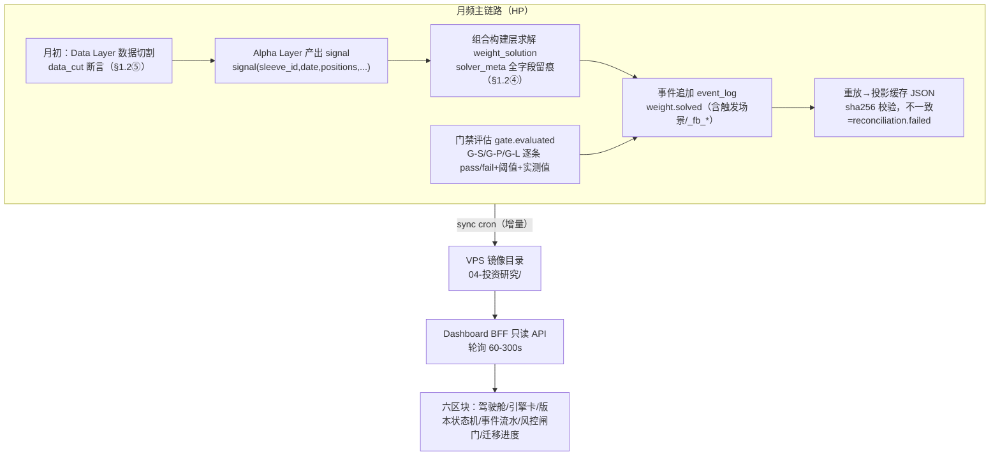

# R-342 R-336 实施级架构设计（含 Dashboard 全新可视化设计）

> 任务 task-0529 ｜ 2026-08-28 ｜ 状态：设计报告（纯设计零代码）
> 设计依据（唯一口径）：R-336 v1.2《破而后立量化系统目标架构与迁移方案》。本文所有「§N」引用除特别注明外均指 R-336 原文章节。新增设计不与 v1.2 冻结条款冲突；凡与冻结条款相关的字段名/阈值/事件类型一律原文引用。

## 架构一图流

```mermaid
flowchart LR
  subgraph HP["HP 量化主机 ~/quant-evolve（唯一写点）"]
    D1["① Data Layer<br/>四口径·tradable_mask"] --> D2["② Alpha Layer<br/>evolution_pipeline"]
    D2 --> D3["③ Backtest Layer<br/>composite_backtest"]
    D3 --> D4["④ 组合构建层<br/>等波动率求解器"]
    D4 --> D5["⑤ Portfolio Layer<br/>portfolio_version"]
    D5 --> D6["⑥ Execution Layer<br/>paper/canary/live"]
    D7["⑦ Risk Layer 横切⑤⑥<br/>熔断>组合级>单腿级"]
    EL["Iteration Ledger<br/>append-only JSONL"]
    D4 -. weight.solved .-> EL
    D5 -. promotion.* .-> EL
    D7 -. risk.action .-> EL
    EL --> PROJ["投影缓存 registry/engines/composites JSON"]
  end
  HP -->|"sync cron（只读镜像）"| subgraph VPS["VPS shared/results/04-投资研究/"]
    SYNC["同步目录：ledger/registry/产物 csv+json"]
  end
  VPS --> READ["新 Dashboard BFF（只读 API，重放投影消费）"]
  READ --> UI["新前端 SPA：六区块，390px 移动端优先"]
  USER["用户"] -->|读| UI
  USER -->|人工门操作（G-L4 批准等）| TC["任务中心/HP 流程"]
```

## 关键决策摘要（≤10 条）

1. **三落点分工**：计算与写入全部在 HP（事件账本、投影、求解器），VPS 只持只读镜像（sync cron 产物），新 Dashboard 是纯只读消费者——写操作（用户批准类，G-L4 唯一人工门，§4.3）一律走任务中心/HP 流程，前端不提供任何写入口。
2. **事件账本照抄冻结条款**：`events/iteration-ledger-YYYY-MM.jsonl`，格式 `{ts, actor, event_type, target, payload}`，flock+fsync+月滚动，投影 sha256 校验（§3.3）。不引入消息队列/数据库（§3.3 明文冻结），本设计不新增任何账本存储引擎。
3. **投影缓存=JSON，读侧加速可选 SQLite 物化**：source of truth 只有账本+JSON 投影；Dashboard 可选一层只读 SQLite 物化（沿用现有 agent-dashboard 的 node:sqlite 基建），语义=「可随时删了重建的投影缓存」（§3.1 表：JSON 降级为投影缓存），不承载任何唯一状态。
4. **七层映射**：现有 HP 管线（evolution_pipeline / registry / paper 引擎 / ddc）分别归 Alpha / Portfolio / Execution / Risk 层载体；**新建**=组合构建层求解器与 Iteration Ledger（§1.2④、§3）；Data 层四口径校验器从现有散点收敛为唯一出口。
5. **portfolio_version schema 一次到位按 v1.2 A1**：sleeves 附 `code_hash + data_cut`、`capital_policy{gross_limit, net_limit}`、solver_ref 扩 `tolerances + fallback`；`data_cut ≤ min(所有输入数据源最大时间戳)` 硬断言，违反即 `config.invalid` 绝对阻塞（§1.2⑤）。
6. **状态机含反向降级**：正向 `candidate → backtested → gated → shadow → approved → paper → canary → live`，反向 `live → shadow`（4 维漂移超标）/ `live → gated`（reconciliation.failed / 断路器 / 审计不合格），全部走 `promotion.downgraded` 事件，禁人工直改 JSON（§1.2⑤）。
7. **Dashboard 技术栈推荐：Vite + React SPA + Express BFF**（备选 SvelteKit 放弃理由见 §4.1）；部署=现有 nginx 反代 + systemd 单元，单机 VPS 零新增常驻依赖之外的基础设施。
8. **实时性=HTTP 轮询**（总览 60s / 其余 300s），不启用 SSE/WebSocket：月频调仓系统的状态变化天然低频（事件级：日/调仓日/门禁评估时），推送通道的连接管理成本 > 收益；预留 Phase C 后按需升级 SSE 的接口形态（同一路径可演进）。
9. **390px 移动端优先为硬约束**：全局 `overflow-x: hidden` + 容器断点组件规范（见 §4.4），任何区块禁横向滚动；表格降级为卡片列表，状态机图降级为状态胶囊。
10. **过渡三步走**：并行新建（Phase B，读旧+新双源）→ 验收（双看板对照 ≥1 个调仓周期）→ 切换（Phase C 指针切换获批准后，nginx 路由级切换，秒级回退）；旧 agent-dashboard 保留至 Phase D 才退役，观测能力不断档。

---

## 第 1 章 系统总览

### 1.1 三落点职责分工

| 落点 | 职责 | 明确不做 |
|---|---|---|
| **HP（~/quant-evolve）** | 全部计算与唯一写入：七层管线、组合构建求解器、Iteration Ledger 追加、投影重放、paper/canary/live 执行 | 不对外提供 UI；不直接对账 VPS 只读镜像 |
| **VPS shared/results/04-投资研究/** | sync cron 落盘的只读镜像：ledger JSONL、registry/engines 投影、各引擎 nav/trades/metrics/holdings 产物族、报告 md | 不在镜像目录做任何回写；镜像即证据 |
| **VPS 新 Dashboard** | 只读 API（BFF）+ 前端呈现：读镜像与投影缓存，重放查询，向用户呈现六区块 | 零写入口：人工门（G-L4 批准、Phase C 指针切换）一律走任务中心/HP 流程 |

写路径唯一性是 §3「append-only、状态可重放」的结构前提：若前端可写，等于绕过事件账本直改状态，正是 R-336 §3.1 表中列为「破」对象的操作模式。

### 1.2 数据流图（月频主链路）

月频链路 = 数据 → 因子 → 组合求解 → 事件流水 → 前端呈现：



要点：
- **事件先行**：每次状态变更（求解、门禁、晋升、降级、风控动作）都先追加事件、后刷投影；前端读投影 + 查事件，二者由同一账本重放生成，天然一致（§3.3 重放伪代码口径）。
- **月频但日更**：调仓是月频，风控监控（D1 日 P&L 偏差 ≤20bp/日，§7.2）与 NAV 对账是每日——所以 Dashboard 的轮询周期按区块分频，而非全局一个频率（详见 §4.3）。
- **canary 未启用**：状态机含 canary 段（§1.2⑥），前端状态图预留该节点但标注「未启用，启用须先定义期限与失效自动降级条件」。

### 1.3 与在役系统的关系

在役 paper/实盘三元组（A 引擎 + gold 引擎 + ddc 风控）在 Phase B 以 vC-0 快照形式进入 portfolio_version（§8 Phase B 动作 1：首条=当前在役三元组），旧 agent-dashboard 与新 Dashboard 并行服务至 Phase C 切换完成；Phase D 旧件退役（§8 Phase D 动作 1：新代码/UI/报告只用标准名）。本设计全部读侧动作不触碰 registry active / paper_engine / HP crontab 在役项。

## 第 2 章 七层落地映射

总原则：**能用现有载体的不重建，重建的只有「构建层求解器 + 事件账本 + 只读 API + 前端」四件**。术语一律用 GLOSSARY 标准名（附录 A：evolution_pipeline=Research-to-Production Pipeline、registry=Model Registry、composites.json=Portfolio Registry）。

| R-336 层（章节） | 实现载体（HP） | 复用/新建 | 落点存储 |
|---|---|---|---|
| ① Data（§1.2①） | 四口径校验器 + data adapter 注册表：PIT 对齐（R-328）、qfq 唯一口径（R-330 F4）、退市全包含、涨跌停 tradable_mask、成本模型（R-333 三情景 4.0/11.5/15.7bp） | 复用散点实现，**收敛为唯一出口**（新 adapter 注册制） | HDF5/Parquet 面板（现有）+ 口径清单 JSON |
| ② Alpha（§1.2②） | evolution_pipeline（registry 版，g1-g6 组件门禁=CG-1..6） | 复用 | signal 面板文件 + registry（投影缓存） |
| ③ Backtest（§1.2③） | composite_backtest + 组件回测；F6/F7 口径插件化（§8 Phase B 动作 3：F1 md5 915e446388… 逐位对齐 + PIT 四锚点断言）；第二裁判=qrun 双轨注册 | 复用+插件化改造 | backtest_report JSON（含 md5_anchor）+ results/ 报告文件 |
| ④ Portfolio Construction（§1.2④） | **新建**：等波动率求解器 v1 → 风险预算/ERC；协方差 LW vs 样本 vs EWMA 对比留档（§8 Phase B 动作 6）；MVO 对比跑批不启用仅留档（§8 Phase B 动作 7） | 新建 | weight_solution 进 event_log（JSONL），永不落可变 JSON |
| ⑤ Portfolio（§1.2⑤） | **新建**：portfolio_version 对象 + vC-0 快照（§8 Phase B 动作 1，schema 按 v1.2 A1 一次到位） | 新建（继承 R-335 设计改名） | event_log + 投影缓存 composites.json |
| ⑥ Execution（§1.2⑥） | paper 引擎复用（语义归 Execution Layer）；canary 段预留未启用；checkpoint 快照接入（§8 Phase C 动作 4） | 复用+指针语义切换（Phase C，需批准） | execution_report JSON + checkpoint 文件 |
| ⑦ Risk（§1.2⑦） | ddc 状态机复用（参数下沉 sleeve 版本对象）；回撤分级闸门/断路器/冷却期按 §4.4 与 §6 落地；裁决三段式=§7.5.3 唯一出处 | 复用+新增闸门 | risk.* 事件进 event_log（risk-events.jsonl 既有资产并入） |

### 2.1 模块间接口（沿 §1.2 输出契约，不新造）

- `bar(symbol, date, ohlqfq_adj, tradable_mask, pit_fields...)` —— Data→上层唯一出口（§1.2①）。
- `signal(sleeve_id, date, positions, ic_series, turnover_estimate)` —— Alpha→Backtest/构建层（§1.2②）。
- `backtest_report(portfolio_version_id, metrics, gate_results[], assumptions[], md5_anchor)` —— Backtest→Portfolio（§1.2③）。
- `weight_solution(portfolio_version_id, solve_date, weights{}, solver_meta{...})` —— 构建层→组合层，**只追加进 event_log**（§1.2④：配置与求解分离，禁止 portfolio_version 上加 model_weights 字段）。
- `execution_report(date, fills, slippage_actual, nav, checkpoint_ref)` —— Execution→账本（§1.2⑥）。

### 2.2 存储选型与理由（每项含备选）

| 存储 | 选型 | 理由 | 备选与放弃理由 |
|---|---|---|---|
| 事件账本 | 本地 JSONL（flock+fsync+月滚动） | §3.3 冻结条款，个人单机下满足「事件不可改、状态可重放、历史可审计」三要件 | SQLite/消息队列：违反 §3.3「不引入消息队列/数据库」冻结约束，放弃 |
| 状态投影 | JSON 文件（重放 dump 回 registry/engines/composites） | §3.1 表冻结：JSON 降级为投影缓存，可随时删了重建 | 数据库为主存储：同上冲突 |
| Dashboard 读侧缓存 | node:sqlite 只读物化（BFF 内，可选） | 复用现有 agent-dashboard v4 基建（Express+node:sqlite 零原生依赖）；语义仍是投影缓存，删了重建无损失 | 纯内存每请求重放：账本增长后轮询每 60s 全量重放开销不可控，放弃 |
| 产物文件 | csv+json 文件族（现状） | 1976 个文件、HP↔VPS rsync 增量同步成熟，回测/复盘工具链直读 | 对象存储/DB：改变 sync cron 与全部下游工具读法，收益为零，放弃 |
